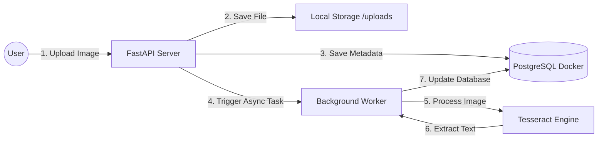

### 📄 README.md

# 🏦 Swiss Document Vault

> **"From Physical Binders to Digital Cloud"**

Living in Switzerland, I realized a stark difference from Korea: almost every administrative process here relies heavily on physical paperwork. While my wife diligently organizes these piles of documents into physical binders, I wanted a more efficient and accessible solution.

I built **Swiss Document Vault** to digitize this analog workflow. My goal was to move our family's important documents from paper folders to the web, making them safe, searchable, and accessible from anywhere.


---

## 🏗 System Architecture & Flow

This project follows a **Layered Architecture**, separating the presentation, business logic, and data access layers.



### 🔄 Workflow Description

1. **Input:** The user uploads a document image via the web interface.
2. **Synchronous Processing:** The server saves the file locally and records the metadata in PostgreSQL with a `Processing` status. It immediately responds to the user to ensure a smooth UX.
3. **Asynchronous Processing (ETL):** A background task triggers the **Tesseract OCR engine**, which extracts text from the image.
4. **Output:** Once extracted, the database is updated. The user can view the original image and the digitized text side-by-side on the detail page.

---

## 🛠 Tech Stack

* **Backend:** Python 3.13, FastAPI
* **Database:** PostgreSQL 15 (via Docker Compose), SQLAlchemy ORM
* **OCR Engine:** Tesseract, Pytesseract, Pillow
* **Frontend:** HTML5, CSS3, Jinja2 Templates
* **Infrastructure:** Docker, Docker Compose

---

## 📂 Project Structure

```bash
fastapi_playground/
├── docker-compose.yml       # Infrastructure: PostgreSQL service definition
├── database.py              # Core: DB session & connection setup
└── Document_Vault/          # Application Layer
    ├── main.py              # API Endpoints & Business Logic
    ├── models.py            # Database Schema (ORM)
    ├── uploads/             # Static file storage
    └── templates/           # UI Presentation
        ├── vault.html       # Dashboard (List View)
        └── detail.html      # Document Detail & OCR Result View

```

---

## 🚀 Getting Started

### 1. Prerequisites

* Docker & Docker Desktop
* Python 3.10+
* Tesseract OCR Engine
* macOS: `brew install tesseract`
* Linux: `sudo apt-get install tesseract-ocr`


### 2. Database Setup

Start the PostgreSQL container using Docker Compose.

```bash
# Run from the root directory
docker compose up -d

```

### 3. Application Setup

Install the required Python dependencies.

```bash
cd Document_Vault
pip install fastapi uvicorn sqlalchemy psycopg2-binary python-multipart aiofiles pillow pytesseract jinja2

```

### 4. Run the Server

Start the FastAPI server in development mode.

```bash
uvicorn main:app --reload

```

* **Access the App:** Open your browser and go to `http://127.0.0.1:8000`

---

## ✨ Key Features

* **📄 Seamless File Upload:** Supports image formats (JPG, PNG) with secure storage.
* **⚡️ Non-blocking OCR:** Utilizes `BackgroundTasks` in FastAPI to handle heavy OCR operations without freezing the server.
* **🔍 Detail Inspector:** A split-screen view to compare the original document with the extracted text.
* **🗑️ Data Integrity:** Implements a clean deletion process that removes both the database record and the actual file from the disk.

---

## 🔮 Future Roadmap

* **PDF Processing:** Integrate `pdf2image` to support multi-page PDF documents.
* **Full-Text Search:** Implement search functionality to find documents by their extracted content.
* **Authentication:** Add user login using JWT (JSON Web Tokens) for private vaults.

```

